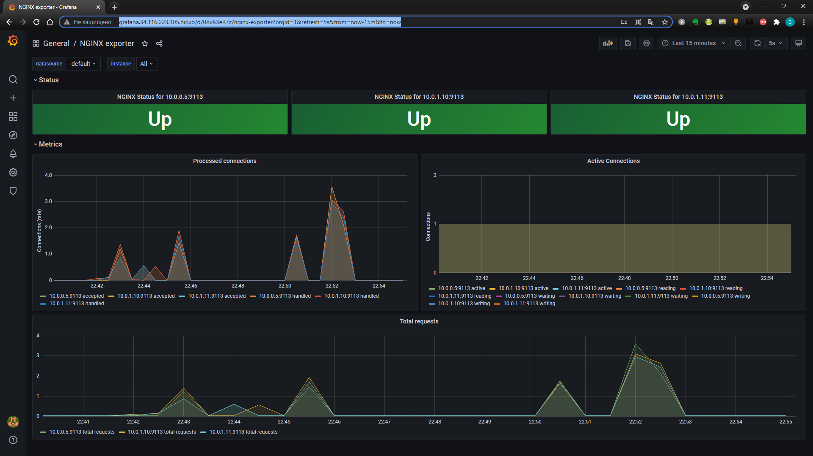

# greysd_platform
greysd Platform repository

## Задание 1

### Почему все pod в namespace kube-system восстановились после удаления

Все под с суфиксом названия машины (в данном случае minikube) статические pod. Kubelet наблюдает за каждым статическим подом и автоматически перезапускает, если они падают)
Статические поды:
* etcd-minikube
* kube-apiserver-minikube
* kube-controller-manager-minikube
* kube-scheduler-minikube

Pod coredns-74ff55c5b-5jv7h Это deployment c параметром Replicas 1 desired что видно из команды:

```
kubectl get deployment -n kube-system
kubectl describe deployment coredns -n kube-system
```

kube-proxy это daemonset который выполняется на каждой ноде в количестве описанном в параметре
Number of Nodes Scheduled with Up-to-date Pods: 1

```
kubectl get daemonsets -n kube-system
kubectl describe daemonset kube-proxy -n kube-system
```

### Выясните причину, по которой pod  frontend  находится в статусе  Error

В логах kubectl logs frontend видно что из-за незаданной переменной окружения PRODUCT_CATALOG_SERVICE_ADDR контейнер падает с паникой
В примере манифеста так же указаны еще несколько переменных окружения отсутствие которое вызовет панику

```
panic: environment variable "PRODUCT_CATALOG_SERVICE_ADDR" not set
```

Для того чтобы контейнер заработал прописываем все переменные окружения описанные в примере манифеста с параметрами по умолчанию

## Задание 2

### Определите, что необходимо добавить в манифест

В манифесте не хватает описание селектора по которому Replicaset будет осуществлять выбор подов для масштабирования

###  опишите произошедшую ситуацию, почему обновление ReplicaSet не повлекло обновление запущенных pod

ReplicaSet следит чтобы количество подов соответствовало описанию, поэтому изменение в спецификации темплейта не привело к изменениям в версиях образа.

### Найдите способ модернизировать свой DaemonSet таким образом, чтобы Node Exporter был развернут как на master, так и на worker нодах

Так как я нашел описание DaemonSet в интернете, то там уже было описание того чтобы он запускался на мастернодах в том числе
      tolerations:
      - operator: Exists

что значит этот toleration подходит для всех ключей, значение и эффектов, то есть запускаться будет на любой ноде

## Задание 3

### task01
Создан аккаунт bob
Дана роль admin
Создан аккаунт dave
### task02
Создан Namespace prometheus
Создан ServiceAccount carol
Даны права get list watch
### task03
Создан Namespace dev
Создан ServiceAccount jane
Jane дана роль admin
Создан ServiceAccount ken
Ken дана роль view


## Задание 4

Создан statefulset
Создан Headless statefulset
Создан Secret
исправлен statefulset на использование secret

## Задание 9

- [x] Создан Dockerfile с nginx и с конфигом где описан basic_status
- [x] Создан deployment с контейнером nginx и nginx_exporter
- [x] Создан сервис для деплоймента
- [x] Установлен Prometheus-operator через helm
- [x] создан ServiceMоnitor
- [x] сделан ыкриншот в графане

